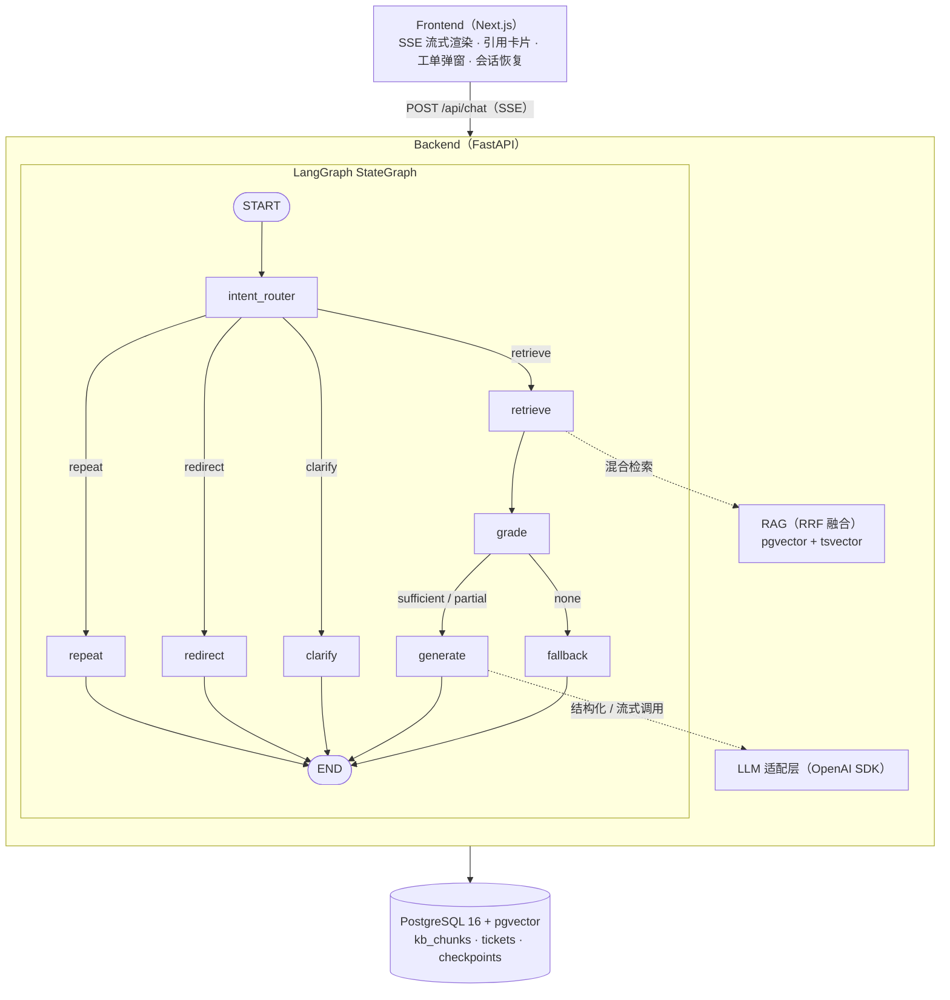
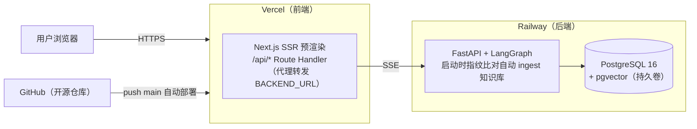
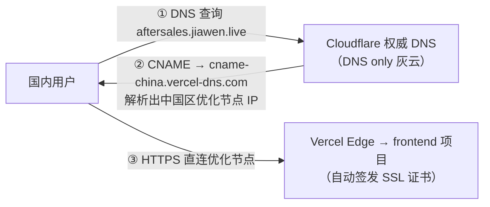
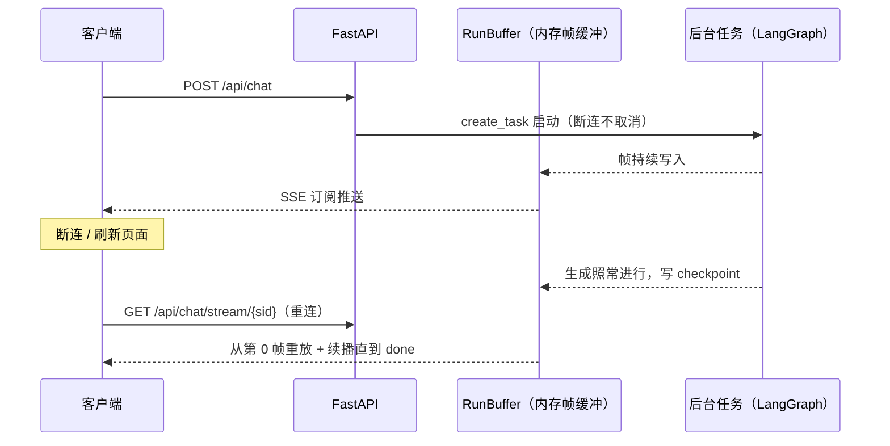

# 售后智能客服 Agent — POC

<p align="left">
  <a href="https://frontend-tau-green-71.vercel.app"></a>
  <a href="https://aftersales.jiawen.live"></a>
  <a href="https://github.com/zzlw/aftersales-agent/deployments"></a>
  <a href="LICENSE"></a>
  <a href="https://github.com/zzlw/aftersales-agent/commits/main"></a>
</p>

<p align="left">
  
  
  
  
  
  
  
  
  
  
  
  
  
</p>

基于 **LangGraph + RAG** 的多轮对话售后客服系统，支持意图识别、知识库检索、引用溯源、工单创建与多语言服务。

> 🚀 **在线体验**（默认地址）：https://frontend-tau-green-71.vercel.app
>
> 🇨🇳 **国内访问**：若上方 Vercel 默认域名因国内网络环境无法打开，请改用镜像域名 https://aftersales.jiawen.live 访问。
> 该镜像通过 Cloudflare DNS（域名权威）将子域名以 DNS only 方式 CNAME 到 Vercel 中国区优化节点（`cname-china.vercel-dns.com`）实现国内可达。
> ⚠️ **注意**：`aftersales.jiawen.live` 为临时演示域名，可能因域名到期而随时失效，以 Vercel 默认域名为准。

## 技术栈

| 层 | 技术 |
|---|------|
| LLM | DeepSeek API（OpenAI 兼容，`deepseek-chat`） |
| Embedding | 硅基流动 SiliconFlow BAAI/bge-m3（1024 维） |
| Agent 框架 | LangGraph 0.4 + AsyncPostgresSaver（会话持久化） |
| 后端 | Python 3.12 + FastAPI + SSE 流式推送 |
| 前端 | Next.js 16（App Router + Turbopack + React Compiler）+ React 19 + TypeScript |
| UI | Tailwind CSS v4 + shadcn/ui + Motion（动画）+ Geist 字体 |
| 数据库 | PostgreSQL 16 + pgvector（HNSW 索引） |
| 部署 | 生产：Vercel（前端）+ Railway（后端 + 数据库）；本地：Docker Compose 一键启动 |

## 架构概览



## 云端部署与 CI/CD

生产环境采用“前后端分离部署”：前端跑在 Vercel（Serverless / Edge），后端和数据库跑在 Railway（常驻容器）——因为 LangGraph 冷启动重、SSE 长连接会被 Serverless 执行时长限制掰断，不适合函数化。



| 环节 | 平台 / 方式 | 说明 |
|---|---|---|
| 代码托管 | GitHub（本仓库，MIT 开源） | `main` 为生产分支 |
| 前端 CI/CD | Vercel 原生 Git 集成 | **push main → 自动构建 + 生产部署**；PR → 自动 Preview 环境；Root Directory 设为 `frontend/`（monorepo 子目录） |
| 前端托管 | Vercel Serverless | SSR + 四个 Route Handler（`/api/chat` `/api/chat/stream/[sid]` `/api/history/[sid]` `/api/ticket`）仅做代理，通过环境变量 `BACKEND_URL` 转发到 Railway |
| 后端托管 | Railway 容器（Dockerfile 构建） | 常驻进程支持 SSE 长连接；启动时按知识库内容指纹比对，语料变更则自动重建索引 |
| 数据库 | Railway PostgreSQL（pgvector 镜像 + 持久化卷） | 向量检索 / 全文检索 / 工单 / LangGraph checkpoint 同库 |
| 密钥管理 | Vercel / Railway 环境变量 | `.env` 不入库，仓库仅提供 `.env.example` 占位模板 |

### 国内访问（Cloudflare DNS + Vercel 中国区节点）

Vercel 默认域名在国内网络环境下常不稳定。为提升国内可达性，额外绑定一个子域名，在域名的**权威 DNS（Cloudflare）**上 **CNAME 到 Vercel 专为中国大陆优化的节点** `cname-china.vercel-dns.com`（区别于默认的 `cname.vercel-dns.com`）：



关键点：
- **记录必须加在权威 DNS 上**：域名 NS 实际委托给谁，记录就必须加在谁那里（本域 NS 在 Cloudflare，在其他 DNS 服务商控制台加的记录公网不可见），可用 `dig NS <domain>` 确认
- **必须 DNS only（灰云）**：关闭 Cloudflare 代理，让流量直达 Vercel 中国节点；开橙云会绕行 Cloudflare 代理、失去中国节点意义且与 Vercel 证书冲突
- **中国区节点**：`cname-china.vercel-dns.com` 走境内可达链路，规避默认节点在国内的高延迟 / 不可达问题
- **临时性**：`aftersales.jiawen.live` 为演示用临时域名，可能因域名到期失效，生产以 Vercel 默认域名为准

```bash
# 复现方式（Vercel CLI + Cloudflare API）
vercel domains add aftersales.jiawen.live <project>
curl -X POST "https://api.cloudflare.com/client/v4/zones/<zone_id>/dns_records" \
  -H "Authorization: Bearer <api_token>" -H "Content-Type: application/json" \
  -d '{"type":"CNAME","name":"aftersales","content":"cname-china.vercel-dns.com","proxied":false}'
```

## 第三方服务清单

| 服务 | 用途 | 费用 |
|---|---|---|
| [DeepSeek](https://platform.deepseek.com) | 对话 LLM（意图路由 / 答案生成 / 检索评估，OpenAI 兼容接口） | 按量付费，极低 |
| [硅基流动 SiliconFlow](https://siliconflow.cn) | Embedding（BAAI/bge-m3，中英双语 1024 维） | 免费额度足够 |
| [Vercel](https://vercel.com) | 前端托管 + CI/CD | Hobby 免费 |
| [Railway](https://railway.com) | 后端容器 + PostgreSQL | 免费额度起步 |
| [GitHub](https://github.com) | 代码托管 / 部署触发源 | 免费 |
| [shields.io](https://shields.io) | README 徽标 | 免费 |

## 核心能力

1. **意图路由**：单次结构化输出判断 intent / language / emotion / product_line / clarify / repeat + 指代消解
2. **混合检索**：pgvector HNSW 向量 + jieba 预分词 tsvector 全文 → RRF 融合
3. **两级评估**：产品线元数据校验 → 分数短路 → LLM 精评（三段递进零浪费）
4. **引用溯源**：生成答案中 `[i]` 标记自动映射到 citation 帧
5. **重复识别**：answered_topics 机制 + is_repeat 路由 → 避免重复回答
6. **知识库盲区兜底**：改写重试一次 → 坦诚告知 → suggest 转人工工单
7. **多语言**：中英文知识库 + 自动识别语言 + 同语言回复
8. **SSE 8 帧协议**：status / thinking / tool / delta / citation / suggest / done / error
9. **全量消息持久化**：引用溯源 / 执行过程 / 建议问题随消息写入 checkpoint，刷新后 SSR 完整回放
10. **完整流恢复（ChatGPT 同款）**：生成与连接解耦，生成中刷页面自动重连并无损续播流式回答

## 快速启动

### 前置条件

- Docker & Docker Compose
- Node.js 20+ & pnpm
- DeepSeek API Key
- 硅基流动 API Key（免费注册即可）

### 步骤

```bash
# 1. 克隆并进入项目
cd aftersales-agent

# 2. 配置环境变量
cp .env.example .env
# 编辑 .env 填入 LLM_API_KEY 和 EMBEDDING_API_KEY

# 3. 启动后端服务（含数据库）
docker compose up -d db backend
# 或全容器启动（含前端镜像，http://localhost:3000，可跳过第 5 步）：docker compose up -d

# 4. 索引知识库（可选：启动时会按内容指纹自动摄取，此命令仅用于手动强制重建）
curl -X POST http://localhost:8000/api/kb/reindex

# 5. 启动前端
cd frontend && pnpm install && pnpm dev
# 浏览器打开 http://localhost:3003
```

### 验证

```bash
# 健康检查
curl http://localhost:8000/healthz

# 知识库状态
curl http://localhost:8000/api/kb/stats

# 对话测试
curl -N -X POST http://localhost:8000/api/chat \
  -H 'Content-Type: application/json' \
  -d '{"session_id":"demo","message":"笔记本电池充不进电怎么办？"}'
```

## 项目结构

```
aftersales-agent/
├── backend/
│   ├── app/
│   │   ├── agent/          # LangGraph 状态图
│   │   │   ├── graph.py    # 图拓扑定义
│   │   │   ├── nodes.py    # 节点实现（核心逻辑）
│   │   │   ├── prompts.py  # Prompt 模板
│   │   │   └── state.py    # AgentState 定义
│   │   ├── api/            # FastAPI 路由
│   │   │   ├── chat.py     # SSE 对话端点 + RunBuffer 流恢复
│   │   │   ├── kb.py       # 知识库管理
│   │   │   └── ticket.py   # 工单 API
│   │   ├── llm/
│   │   │   └── client.py   # 模型适配层
│   │   ├── rag/
│   │   │   ├── ingest.py   # 知识库摄取管线（含内容指纹）
│   │   │   └── store.py    # 混合检索实现
│   │   ├── config.py       # 配置管理
│   │   └── main.py         # 应用入口
│   ├── Dockerfile          # 本地 Docker Compose 构建
│   └── requirements.txt
├── frontend/
│   └── src/
│       ├── app/
│       │   ├── api/                 # 4 个 Route Handler（代理转发 BACKEND_URL）
│       │   │   ├── chat/            # POST 对话；stream/[sid] 流恢复重连
│       │   │   ├── history/[sid]/   # 历史消息 + generating 标志
│       │   │   └── ticket/          # 工单提交
│       │   └── layout.tsx / page.tsx  # SSR 页面
│       ├── components/
│       │   ├── Chat.tsx        # 聊天主组件
│       │   └── ui/             # shadcn/ui 组件
│       └── lib/sse.ts          # SSE 解析器
├── knowledge/              # 知识库语料（14 篇：5 产品线 + 通用政策）
│   ├── zh/                 # 中文文档
│   └── en/                 # 英文文档
├── docker-compose.yml      # 本地一键启动（db + backend + 可选 frontend 容器）
├── Dockerfile.railway      # Railway 后端镜像（app + knowledge 打包）
├── railway.json            # Railway 构建配置
├── AGENTS.md               # AI 协作约束文档
├── .env.example
└── demo.sh                 # 演示脚本
```

## SSE 帧协议

| 事件 | 用途 | 数据示例 |
|------|------|----------|
| `status` | 阶段通知 | `{"stage":"routing"}` |
| `thinking` | 推理过程 | `{"text":"意图=troubleshoot ..."}` |
| `tool` | 工具调用 | `{"name":"hybrid_search","hits":[...]}` |
| `delta` | 流式文本 | `{"text":"您好"}` |
| `citation` | 引用溯源 | `{"items":[{"title":"...","snippet":"..."}]}` |
| `suggest` | 建议操作 | `{"items":["转人工"],"action":"ticket"}` |
| `done` | 对话结束 | `{"session_id":"..."}` |
| `error` | 错误信息 | `{"message":"服务暂时不可用，请稍后重试（...）"}` |

### 流恢复（ChatGPT 同款）

生成与 SSE 连接完全解耦，客户端断连 / 刷新不会丢失正在生成的回答：



- **生成不中断**：graph 在后台任务执行，HTTP 响应只是缓冲的一个订阅者，断连后照常跑完并写 checkpoint
- **重连无损续播**：`/api/history` 返回 `generating` 标志，前端命中则重连流恢复端点，从第 0 帧重放全部已产生帧并续播新帧直到 done，流式动画完整重建
- **完成后容错**：done 后缓冲保留 120s，容忍「刚完成即刷新」的重连竞态；单实例部署用进程内缓冲，多实例可平滑替换为 Redis Pub/Sub

## 设计亮点

- **产品线校验先行**：阻止"服务器保修"词面命中"笔记本保修"文档的误判
- **jieba 预分词方案**：无需安装 PostgreSQL 中文分词扩展（zhparser/pg_jieba），部署零依赖
- **延迟控制**：路由一次结构化调用 6 项判断；grade 规则短路避免 90% 场景的 LLM 调用
- **Prompt 注入防护**：域外意图识别 + system prompt 角色锁定，经测试抵御 DAN/越狱攻击
- **会话持久化**：LangGraph AsyncPostgresSaver 自动管理，刷新页面会话不丢失
- **刷新前后一致**：citations / timeline / suggests 作为消息元数据随 checkpoint 落库，喂 LLM 的历史消息另行净化为纯 role/content，两不干扰
- **流恢复**：生成中刷新不丢回答，重连后从头重放并续播（见上文「流恢复」一节）
